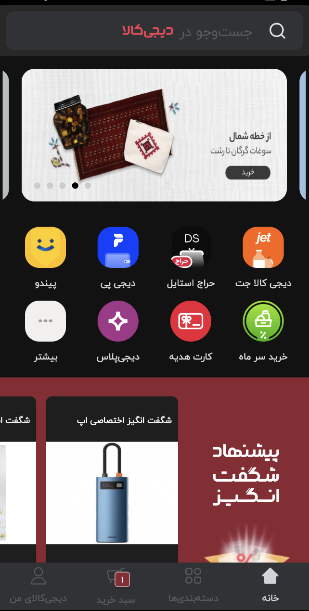
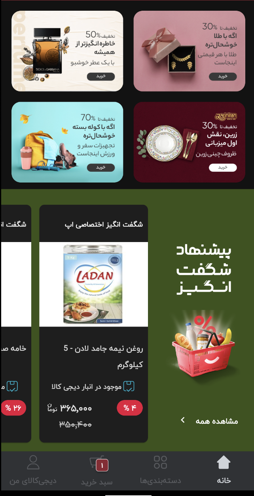
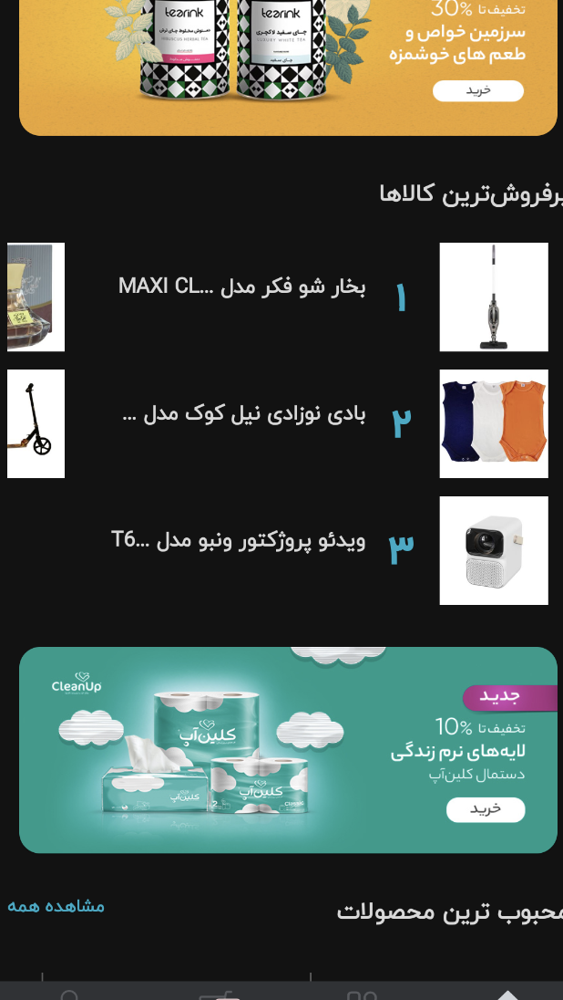
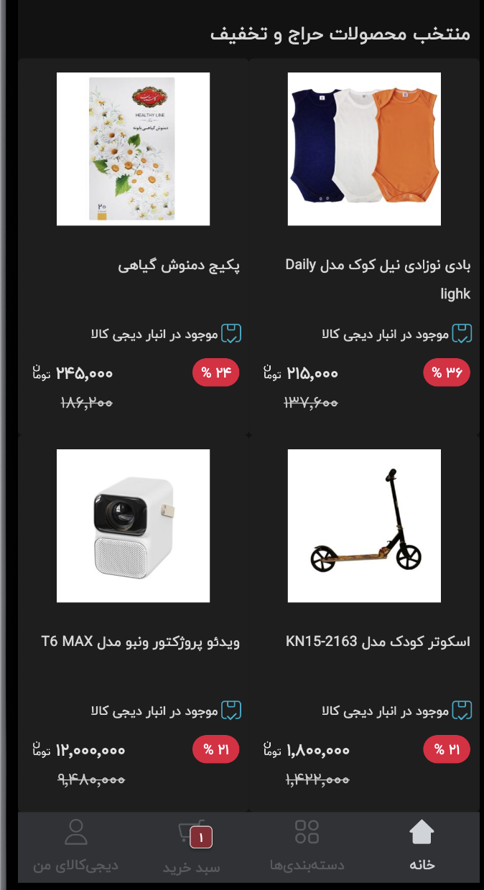
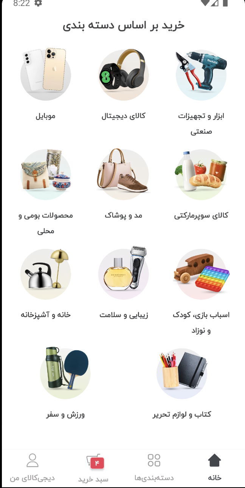
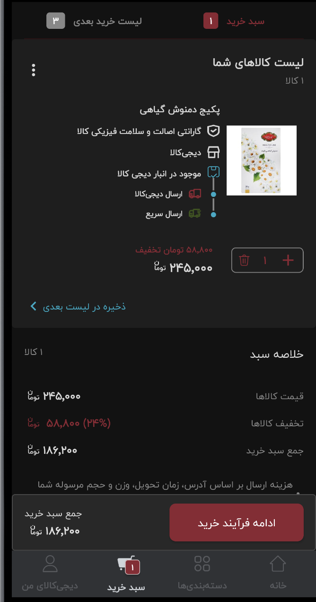
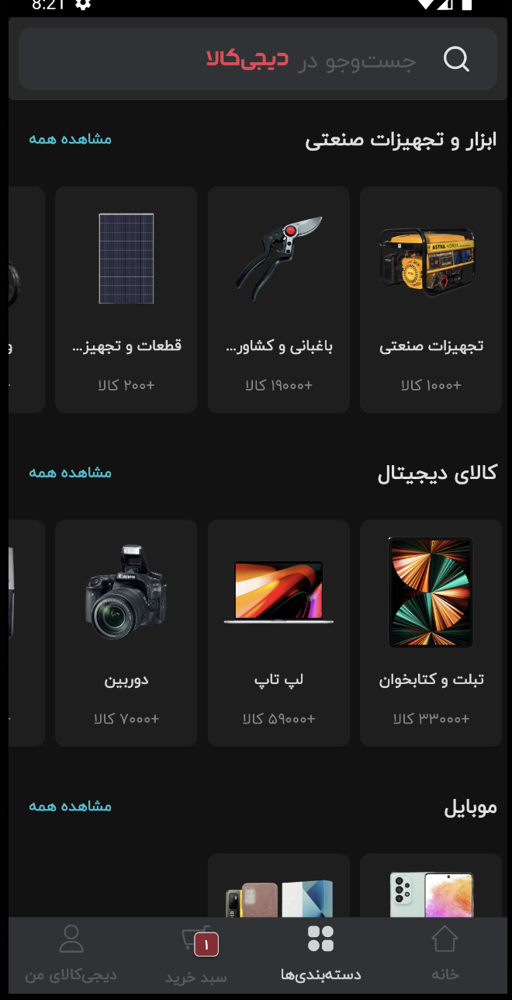

# Digikala Clone

Digikala Clone is a native Android shopping app inspired by the Digikala experience. The project is built with Kotlin and Jetpack Compose and focuses on a complete storefront flow: home content, categories, cart management, profile/login screens, checkout, localized UI, and external Digikala service links.

## Screenshots

<p align="center">
  
  
  
  
</p>

<p align="center">
  
  
  
  
</p>

## Features

- Jetpack Compose UI with Material components and a custom Digikala-inspired theme.
- Home feed with sliders, amazing offers, supermarket offers, banners, category shortcuts, best sellers, most visited, most favorite, and discounted products.
- Category page powered by remote sub-category data.
- Basket flow with current and next-cart tabs, item count badges, local cart persistence, quantity updates, cart status changes, and payable price/discount calculation.
- Profile flow with phone/email validation, password validation, login request handling, and persisted user session data.
- Checkout screen with top bar and address section.
- Bottom navigation for Home, Category, Basket, and Profile.
- WebView route for Digikala-related external services such as Digikala Jet, Digistyle, Digipay, Pindo, Gift Card, Digiplus, and more.
- Persian and English language support with RTL/LTR layout handling.
- Pull-to-refresh support on the home feed.
- Light and dark theme support.

## Tech Stack

- Kotlin
- Jetpack Compose
- Compose Navigation
- MVVM architecture
- Hilt dependency injection
- Retrofit and Gson
- OkHttp logging interceptor
- Room database
- DataStore Preferences
- Kotlin Coroutines and Flow
- Coil image loading
- Lottie animations
- Accompanist SwipeRefresh, Pager, and System UI Controller

## Project Structure

```text
app/src/main/java/com/alirahimi/digikalaclone
├── data
│   ├── datastore      # Encrypted preference storage for language/session values
│   ├── db             # Room database and basket DAO
│   ├── model          # Home, category, basket, address, and profile models
│   └── remote         # Retrofit API contracts and network response wrappers
├── di                 # Hilt modules for APIs, database, DAO, DataStore, and network setup
├── navigation         # App routes, nav graph, and bottom navigation
├── repository         # Data layer used by ViewModels
├── ui                 # Compose screens, reusable components, and theme files
├── util               # Constants, AES helper, validation, digit, and locale helpers
└── viewmodel          # Screen state and business logic
```

## API Layer

The app communicates with the configured backend through Retrofit. The current API contracts cover:

- Home content: sliders, banners, product rails, categories, and offer sections.
- Category content: sub-categories.
- Basket and checkout suggestions.
- Profile login.
- Address-related requests.

The base URL is configured in `Constants.kt`.

## Local Storage

Room is used for the shopping cart. `BasketDao` supports inserting items, removing items, changing item status, changing quantity, streaming cart items by status, and reading cart counters.

DataStore is used for persisted app preferences and user session values. String values are encrypted before being written and decrypted when read.

## Configuration

Create a `key.properties` file in the project root before building the app:

```properties
X_API_KEY="your-api-key"
KEY="your-aes-key"
IV="your-aes-iv"
```

These values are read by Gradle and exposed through `BuildConfig` for the API key and encrypted DataStore helpers.

## Getting Started

1. Clone the repository.
2. Open the project in Android Studio.
3. Add `key.properties` with the required values.
4. Sync Gradle.
5. Run the `app` configuration on an emulator or Android device.

## Build

```bash
./gradlew assembleDebug
```

A release APK is also included in `app/release/app-release.apk`.

## Download

- [Download Version May 2023](https://drive.google.com/file/d/1HIsELeisIR8YQeR-238GBOyBGLfLtLGo/view?usp=share_link)

## Notes

This project is a learning and portfolio clone of Digikala's Android shopping experience. It is not affiliated with Digikala.
